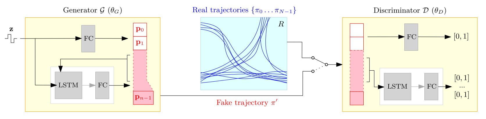
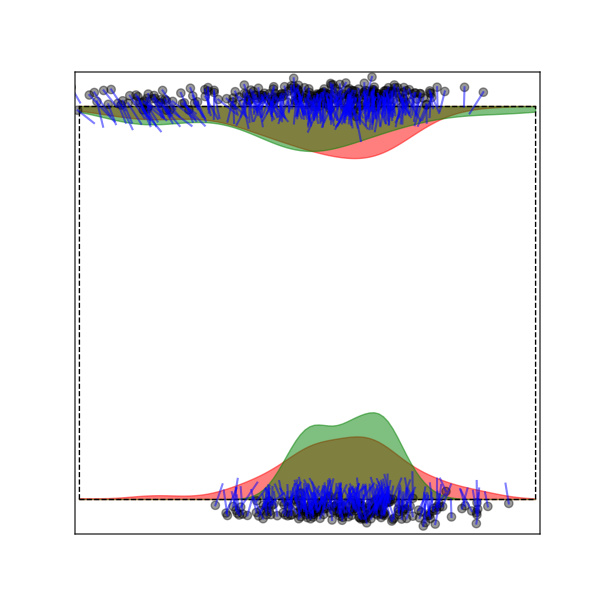
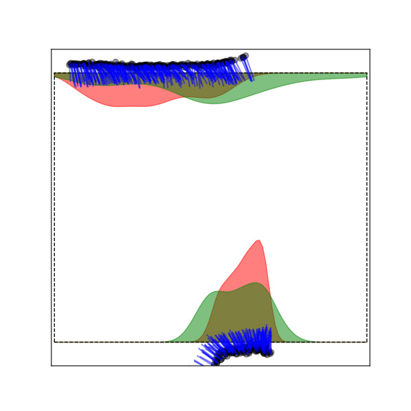
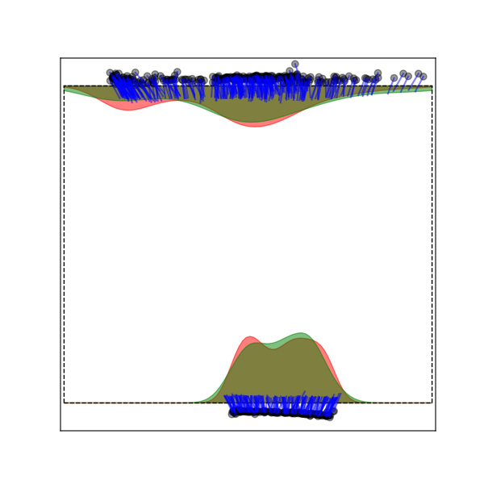
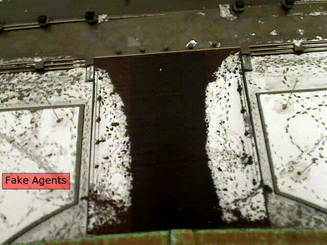

# CrowdGAN
Pytorch implementation for the paper:

[**Data-driven Crowd Simulation with Generative Adversarial Networks**](https://dl.acm.org/doi/abs/10.1145/3328756.3328769)  
Authors: *<a href="http://people.rennes.inria.fr/Javad.Amirian/">Javad Amirian</a>,
<a href="https://team.inria.fr/rainbow/wouter-van-toll/">Wouter van-Toll</a>,
<a href="http://aplicaciones.cimat.mx/Personal/jbhayet">Jean-Bernard Hayet</a>,
<a href="http://people.rennes.inria.fr/Julien.Pettre/">Julien Pettre</a>*  
Presented at [CASA 2019](https://casa2019.sciencesconf.org/) (Computer Animation and Social Agents)  [[arxiv](https://arxiv.org/pdf/1905.09661.pdf)], [[slides]()] 

## System Overview
Generally a GAN system is composed of a Generator and a Discriminator.
On the left side of the figure below, you see the Trajectory Generator and on the right side, you see the Trajectory Discriminator. 
<p align='center'>
  
</p>

However for implementation we use two separate GANs:
1. **Entry-Point GAN**: which is responsible just for generating the first two points of a trajectory
2. **Predictor GAN**: which takes the beginning of a trajectory and predicts the rest of it step-by-step.

## Results
We tested our system on [ETH walking pedestrians dataset](https://vision.ee.ethz.ch/en/datasets/):

### 1) Generating Entry points:
* Left: Using Gaussian Mixture Model
* Middle: Using Vanilla-GAN
* Right: Using Unrolled-GAN (our implementation)
<p align='center'>
  
  
  
</p>
<p align='center'>
  
</p>

### 2) Generating Trajectories
* Left: Real Agents
* Right: Fake (Generated) Agents

<p align='center'>  
    
    
</p>

## Code
### 1) Training
In order to training the system, you need to train ```Entry-Point GAN``` and ```Predictor GAN``` separately:
```bash
$ cd src
$ python entrypointGAN.py
$ python predictorGAN.py
```
* **Hyper-parameters:** All the hyper-parameters are stored in [```config.yaml```](./config/config.yaml)
 
### 2) Trajectory Generation
After training, to generate the trajectories you need to run the following command:
```bash
$ python simulation.py
```

## Notes on Running the Path Follower
### 1. How to use the WASP program

On Windows, execute the program WASP-ConsoleApplication.exe via the command line.
If you run it without arguments, a help text will appear that hopefully speaks for itself.
With the correct arguments, the program will run a simulation and write the output to a new ".trajectories" file.
The filename contains a timestamp so that it won't overwrite an existing result.

The program requires:
- an `.env` file that describes the obstacles of an environment. 
You don't have to worry about this; I've already prepared such a file for each scene that we care about.

- also a `.trajectories` file that contains the input trajectories of the simulation. 
These should be the trajectories computed by our GAN, combined with the right start times provided by a simple scheduler.

   - The `XXX-filtered.trajectories` files contain the original datasets, filtered to match a certain region of interest.
   - The `XXX-simulation.trajectories` files contain the simulation output using `XXX.env` and `XXX-filtered.trajectories` input. That is, they are the results of the command:
```
$ WASP-ConsoleApplication "XXX.env" "XXX-filtered.trajectories" 1000 4
```
where XXX is of course replaced by a dataset name.

By the way, WASP means "Wouter's Agent-based Simulation Platform", and I chose this name because the orange disks in my GUI demo remind me of flying insects ;)

### 2. How to interpret a ".trajectories" file

This is comparable the BIWI format, but with a few adjustments/simplifications.

A ".trajectories" file starts with three special lines:

- `MATRIX 1 0 0 0 0 1 0 1 0` = A 3x3 transformation matrix (written row by row) to apply to all coordinates in the file.
  In our example files, you may assume that the matrix always looks like the one above, 
  so there will be coordinates in the format "x 0 z" which denote a 2D point (x,z).
- `FPS 10` = The number of frames per second in the simulation. 
  In our example files, this will always be 10. Use this to translate a frame number to a timestamp.
- `ROI 0 -12 10 0` = An axis-aligned bounding box (xmin ymin xmax ymax) describing the region of interest.
  Watch out: the ROI will probably be different for each scenario! Even zara01 and zara02 don't use the same coordinates.
  In our paper, all generated trajectories should start and end on the boundary of this region, approximately.
  (For each trajectory, the first and last samples will be either on this boundary or just outside it.)

After this header, the file contains many rows in the following format: `frameNr agentID x y z`

- To convert a frameNr to a concrete timestamp (in seconds), divide it by the FPS value.
- Agent IDs should be unique and non-negative.
- For the y-coordinate, you can most likely just print a 0 every time (if you use the same matrix given above).
- You may add more data to a line (e.g. velocities such as in the BIWI format), but it will be ignored by WASP.

**Watch out:** The points on a trajectory should be given in chronological order, otherwise the program won't work. 
However, it doesn't matter how much time there is between samples; this interval can even change during the trajectory. 
Also, it doesn't matter if you order the lines per frame or per agent, 
although I expect that an ordering per agent is easiest to make (simply write the full trajectories one by one).

### 3. How to use the TrajectoryFileConverter program

On Windows, execute the program TrajectoryFileConverter.exe via the command line.
If you run it without arguments, a help text will appear that hopefully speaks for itself.
With the correct arguments, the program will read a ".trajectories" file and convert it to separate ".csv" files (one for each agent) to use in the ChAOS visualization program.

**Watch out:** The output folder should already exist, because the program does not have the right to create this folder on its own.

## Reference
If you use this code for your research, please cite our paper:
```
@inproceedings{amirian2019crowdgan,
  title={Data-Driven Crowd Simulation with Generative Adversarial Networks},
  author={Amirian, Javad and Van Toll, Wouter and Hayet, Jean-Bernard and Pettr{\'e}, Julien},
  booktitle={Proceedings of the 32nd International Conference on Computer Animation and Social Agents},
  pages={7--10},
  year={2019}
}
```
